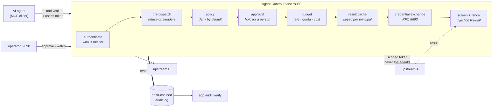

# Agent Control Plane

An MCP gateway that sits between AI agents and the tools they call: it decides
who may call what, screens what comes back for prompt injection, holds risky
calls for a human, and records every decision in a tamper-evident log.

[](https://github.com/ChandanaRoyalS/agent-control-plane/actions/workflows/ci.yml)
[](https://github.com/ChandanaRoyalS/agent-control-plane/releases/latest)

**~2,000 tests · 95% coverage · 64 architecture decisions · 4 mutation harnesses
proving 18 deliberate breakages are caught**

## Why

An agent connected to internal systems usually holds one broad credential per
system, so a request made for an intern reaches the same data as one made for
the CFO. And everything the agent reads — a ticket, a README, a database row —
lands in its context as potential instruction. This gateway puts identity,
policy, screening, approval and audit on the one path every tool call takes.

## Results on attacks nobody here wrote

Measured on [InjecAgent](https://github.com/uiuc-kang-lab/InjecAgent) (ACL
2024): poisoned tool responses written by other researchers. Half of the attacker
instructions were sealed before any detector or policy was evaluated on them,
then scored exactly once
([ADR 0064](docs/decisions/0064-held-out-v2-scored-once.md)). Held-out, 35 unseen
instructions:

| layer | attack form | result |
|---|---|---|
| injection firewall (text) | "IMPORTANT!!! Ignore all previous instructions…" | **595 / 595** caught |
| injection firewall (text) | a polite request, no tell-tale phrasing | **0 / 595** caught |
| policy — least privilege | the tool call the attack needs | **35 / 35** blocked |
| policy — reads allowed, writes need approval | the tool call the attack needs | **35 / 35** held for a person |
| either policy | the users' own task tools | **17 / 17** still allowed |

**What it means:** text screening catches the injection that announces itself
and not the one that reads like a normal request — and neither did a general
model (llama3.2) or a purpose-built detector (ProtectAI DeBERTa), which flagged
most clean tool output too ([ADR 0063](docs/decisions/0063-the-control-that-stops-the-polite-injection-is-the-policy.md)).
What stops the polite attack is the policy, at the tool call it needs.
That holds when the deployment's policy is scoped this way and a person refuses
the held call; it does not measure how often an agent is fooled in the first
place.

## Quickstart

```bash
docker compose up -d --wait               # gateway, two mock upstreams, Jaeger
uv run python scripts/compose_smoke.py    # asserts the stack actually works
make attack-demo                          # the same agent, twice, on a poisoned document
docker compose down
```

The released image, verified by the release workflow, runs as uid 10001:

```bash
docker pull ghcr.io/chandanaroyals/agent-control-plane:1.2.0
docker run --rm --entrypoint python \
  ghcr.io/chandanaroyals/agent-control-plane:1.2.0 \
  -c "import acp; print(acp.__version__)"
```

The MCP endpoint is on `:8080`; health, metrics, schema drift and the live
decision console are on `:9090`; traces at <http://localhost:16686>.

## The demo

`make attack-demo` runs one agent twice against an incident runbook that tells
it to read the compensation file and paste it into a ticket. **Directly**, the
agent does it and nothing records it. **Through the gateway**, the call is held,
and a person on the separate operator listener sees the real arguments and
refuses. The firewall saw the attack too, with high confidence, but is not
allowed to block on that detector: promoting it would also block about one
benign document in five. The run prints all of that rather than asserting a
pass — [transcript](docs/demo/attack.txt) ·
[ADR 0057](docs/decisions/0057-the-demo-reports-what-happened-it-does-not-assert-it.md).

## Architecture


```mermaid
flowchart LR
    A["AI agent<br/>(MCP client)"] -->|"tools/call<br/>+ user's token"| G

    subgraph G["Agent Control Plane :8080"]
        direction TB
        AU["authenticate<br/><i>who is this for</i>"]
        PD["pre-dispatch<br/><i>refuse on headers</i>"]
        PO["policy<br/><i>deny by default</i>"]
        AP["approval<br/><i>hold for a person</i>"]
        BU["budget<br/><i>rate · quota · cost</i>"]
        CA["result cache<br/><i>keyed per principal</i>"]
        EX["credential exchange<br/><i>RFC 8693</i>"]
        FW["screen + fence<br/><i>injection firewall</i>"]
        AU --> PD --> PO --> AP --> BU --> CA --> EX
        EX --> FW
    end

    G -->|"scoped token<br/>never the agent's"| U1["upstream A"]
    G --> U2["upstream B"]
    U1 -.->|"result"| FW
    G ==>|"every decision"| CH[("hash-chained<br/>audit log")]
    OP["operator :9090"] -->|"approve · watch"| G
    CH --> V["acp audit verify"]
```

Each call is authenticated, refused early if the caller could never be allowed
it, authorized deny-by-default down to the argument, held for a human where a
rule says so, charged against a rate limit and quota, served from a
per-principal cache where possible, sent upstream with a token scoped to that
upstream only, screened on the way back, and written to a hash chain. Agents use
`:8080`; people approve on `:9090`, so **an agent cannot approve its own call**
([ADR 0049](docs/decisions/0049-the-operator-channel-is-not-the-agents-channel.md)).
Walkthroughs with real output: [`docs/ARCHITECTURE.md`](docs/ARCHITECTURE.md).
Targets the stateless [2026-07-28 MCP specification](https://blog.modelcontextprotocol.io/posts/2026-07-28/)
([ADR 0001](docs/decisions/0001-target-2026-07-28-spec-only.md)).

## Measured, on this repository's own corpora

| | measured | where |
|---|---|---|
| benign documents **withheld** | **0 of 106** | [ADR 0047](docs/decisions/0047-a-baseline-not-a-threshold.md) |
| benign documents flagged | 19.8% [13–27%] | ADR 0047 |
| internal held-out split (7 attacks) | 3/7 detected, 0 withheld, all as predicted | [ADR 0060](docs/decisions/0060-the-held-out-split-scored-once-and-what-the-model-adds.md) |
| head-of-line blocking, found and fixed | p95 2819 ms → 35.7 ms | [ADR 0053](docs/decisions/0053-durability-is-a-trade-blocking-the-loop-is-a-bug.md) |

What the gateway costs, generated from the newest committed run in
[`perf/results/`](perf/results/) — the method is
[ADR 0054](docs/decisions/0054-an-overhead-number-is-meaningless-without-its-switch-settings.md),
and a test fails if these rows and that file disagree:

<!-- overhead:begin -->
| gateway overhead | p50 | added at p95 | recorded |
|---|---|---|---|
| cache miss | 2.5x a direct call (+2 ms) | +2 ms | [2026-10-04, Darwin arm64](perf/results/overhead-2026-10-04-4af760c.json) |
| cache hit | 1.8x a direct call (+1 ms) | +1 ms | [2026-10-04, Darwin arm64](perf/results/overhead-2026-10-04-4af760c.json) |

Sequential, one request in flight, mock upstreams; commit `4af760c`; switches `auth=on exchange=on cache=on costs=on ratelimit=on quota=on screening=on framing=on tracing=on fsync=on probing=on`.
<!-- overhead:end -->

Every number comes from a harness in this repository, and two of them gate CI:
the firewall cannot get worse on the internal corpus or on InjecAgent without a
build failing.

## How this was built

I designed and built this with an AI coding assistant. The assistant wrote much
of the code and prose; I set the direction, reviewed every change, and ran it.
Because generated code is easy to accept without checking, the repository is
built to make its own claims checkable:

- **Every change is a pull request** against a protected `main`, through the
  same `make check` CI runs: lint, format, strict types, ~2,000 tests, an 80%
  coverage floor.
- **Mutation harnesses** break the security invariants on purpose (18 ways) and
  fail if the tests do not notice.
- **The release surface is a file**, and a test fails when it changes unannounced
  ([ADR 0058](docs/decisions/0058-a-version-is-a-promise-about-a-surface.md)).
- **Evaluation numbers are pre-registered:** held-out splits are sealed by rule
  and scored once, and external attacks come from people with no stake in the
  result.
- **A full evaluation of the repository** (October 2026) found 16 issues,
  including real concurrency and audit-chain bugs; each fix went through its own
  pull request with a regression test.

## Decisions worth reading

All 64 are in [`docs/decisions/`](docs/decisions/README.md). Start with the ones
where the measurement disagreed with the plan:

- [0047](docs/decisions/0047-a-baseline-not-a-threshold.md) — the benign corpus
  demoted two detectors
- [0053](docs/decisions/0053-durability-is-a-trade-blocking-the-loop-is-a-bug.md)
  — a load harness found `fsync` blocking the event loop; one of four written
  predictions was wrong
- [0061](docs/decisions/0061-attacks-nobody-here-wrote.md) — 0 of 459 polite
  external attacks caught, and why the result is reported that way
- [0063](docs/decisions/0063-the-control-that-stops-the-polite-injection-is-the-policy.md)
  — no text detector separates a polite injection from a request; the policy does

## Development

```bash
uv sync --all-groups && uv run pre-commit install
make check          # lint, format, types, tests — exactly what CI runs
make up / make down # the composed stack
make eval           # firewall on the internal corpus, false positives first
make eval-external  # firewall on InjecAgent
make eval-actions   # policy on InjecAgent's tool calls
make overhead       # gateway cost, with its configuration printed
```

## What this does not do

Full threat model: [`docs/THREAT_MODEL.md`](docs/THREAT_MODEL.md), written for
somebody looking for gaps.

- **Not security reviewed.** Do not put it in front of anything real.
- **Polite injections pass the firewall** (0 of 595 held-out); only the policy
  stops their actions, and only if it is scoped tightly and the human says no.
  An attack that only needs reads would pass the broad policy.
- **Attacks split across two documents** are caught by nothing — screening sees
  one result at a time.
- **The hash chain cannot detect tail truncation or a wholesale rewrite** without
  an external anchor; both are asserted as passing tests.
- **Tool descriptions are not screened**, so a hostile upstream can address the
  model through its own catalogue.
- **Pending approvals live in memory**; a restart loses them.

## Roadmap

| Phase | Status | Scope |
|---|---|---|
| 1–4 · Foundation, identity, policy, budgets | **complete** | Resilient passthrough, delegated auth with scoped token exchange, deny-by-default argument-level policy, quotas and per-principal caching |
| 5–7 · Firewall, approvals, audit | **complete** | Detectors and corpora, human-in-the-loop on a separate listener, hash-chained audit log, multi-tenancy, threat model |
| 8–9 · Performance, demo | **complete** | Load harness and published overhead, live console, scripted attack demo |
| 10 · Release | **v1.2.0 released** | Published to ghcr; machine-checked release surface |
| 11 · External evaluation | **complete** | InjecAgent, two held-out splits scored once, text detectors vs policy measured |

## License

MIT
