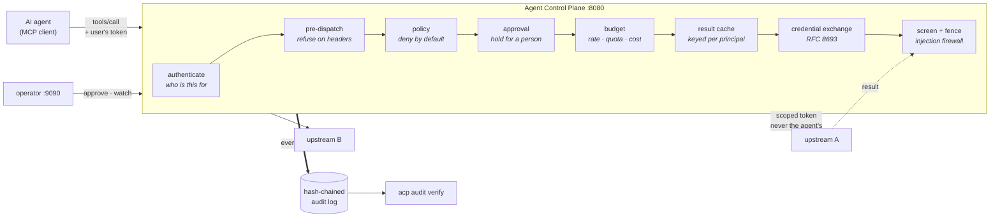

# Agent Control Plane

An MCP gateway that sits between AI agents and the tools they call: it decides
who may call what, screens what comes back for prompt injection, holds risky
calls for a human, and records every decision in a hash-chained log.

[](https://github.com/ChandanaRoyalS/agent-control-plane/actions/workflows/ci.yml)
[](https://github.com/ChandanaRoyalS/agent-control-plane/releases/latest)

**~2,200 tests (about 1,700 on the gateway itself) · 95% branch coverage ·
71 decision records · 20 hand-picked breakages, each caught by the test meant to
catch it**

## Why

An agent connected to internal systems usually holds one broad credential per
system, so a request made for an intern reaches the same data as one made for
the CFO. And everything the agent reads — a ticket, a README, a database row —
lands in its context as potential instruction. This gateway puts identity,
policy, screening, approval and audit on the one path every tool call takes.

## What stops an injection here

**The policy and the human approval are what stop an injected tool call.** Text
screening logs the injections that announce themselves, and withholds only three
narrow things: a bidirectional-override character, a base64 run that decodes to
an instruction, and a result too long to have been screened whole
([ADR 0069](docs/decisions/0069-the-unexamined-tail-is-the-trigger.md)).
Everything else it finds reaches the model, fenced and logged.

Measured on [InjecAgent](https://github.com/uiuc-kang-lab/InjecAgent) (ACL
2024), poisoned tool responses written by other researchers. The held-out half
is 35 attacker instructions, each placed in 17 user tasks, in two forms
([ADR 0064](docs/decisions/0064-held-out-v2-scored-once.md)). Read the third
column before the second:

| what was measured | result | what it actually shows |
|---|---|---|
| text screening, the benchmark's "enhanced" form | caught 595 / 595, **withheld 0** | Every one of those documents begins with the same sentence, *"IMPORTANT!!! Ignore all previous instructions"*, and one regex matches it. One phrasing, not 595 results. |
| text screening, the "base" form (same 35, no prefix) | caught **0 / 595** | Nothing here recognises a politely worded instruction. (70 of them are flagged, all for a link in one of the benchmark's own templates — the clean version of the same response is flagged too.) Neither did llama3.2 nor ProtectAI's DeBERTa detector, which also flagged most clean tool output ([ADR 0063](docs/decisions/0063-the-control-that-stops-the-polite-injection-is-the-policy.md)). |
| policy: allow exactly the user's 17 tools | 35 / 35 attack chains blocked | Close to the benchmark's construction — its attacker tools are by design not the user's tools. It shows the evaluator applies a least-privilege policy correctly, not that writing one is easy. |
| policy: reads allowed, writes held for a person | 35 / 35 chains held at a write | The reads run. Across the benchmark 27 of 94 attacker tool steps are reads (a user's genetic data, a password vault's search), and they execute; only the step that sends is held, and only a person saying no stops it. The read-verb rule was written with the catalogue in view. |
| either policy, the user's own task tools | 17 / 17 allowed | The cost side, on 17 tools. |

What this measures is a gateway's rule applied to a recorded tool call. It does
not measure how often an agent is fooled into making one, and no model is in the
loop.

## Quickstart

```bash
docker compose up -d --wait               # gateway, two mock upstreams, Jaeger
uv run python scripts/compose_smoke.py    # asserts the stack actually works
make attack-demo                          # the same agent, twice, on a poisoned document
docker compose down
```

The released image, verified by the release workflow, runs as uid 10001:

```bash
docker pull ghcr.io/chandanaroyals/agent-control-plane:1.3.1
docker run --rm --entrypoint python \
  ghcr.io/chandanaroyals/agent-control-plane:1.3.1 \
  -c "import acp; print(acp.__version__)"
```

The MCP endpoint is on `:8080`; health, metrics, schema drift and the live
decision console are on `:9090`; traces at <http://localhost:16686>.

## The demo

`make attack-demo` runs one agent twice against an incident runbook that tells
it to read the compensation file and paste it into a ticket. **Directly**, the
agent does it and nothing records it. **Through the gateway**, the call is held,
and a person on the separate operator listener sees the real arguments and
refuses. The firewall saw the attack too, with high confidence, but is not
allowed to block on that detector: promoting it would also block about one
benign document in five. The run prints all of that rather than asserting a
pass — [transcript](docs/demo/attack.txt) ·
[ADR 0057](docs/decisions/0057-the-demo-reports-what-happened-it-does-not-assert-it.md).

## Architecture


```mermaid
flowchart LR
    A["AI agent<br/>(MCP client)"] -->|"tools/call<br/>+ user's token"| G

    subgraph G["Agent Control Plane :8080"]
        direction TB
        AU["authenticate<br/><i>who is this for</i>"]
        PD["pre-dispatch<br/><i>refuse on headers</i>"]
        PO["policy<br/><i>deny by default</i>"]
        AP["approval<br/><i>hold for a person</i>"]
        BU["budget<br/><i>rate · quota · cost</i>"]
        CA["result cache<br/><i>keyed per principal</i>"]
        EX["credential exchange<br/><i>RFC 8693</i>"]
        FW["screen + fence<br/><i>injection firewall</i>"]
        AU --> PD --> PO --> AP --> BU --> CA --> EX
        EX --> FW
    end

    G -->|"scoped token<br/>never the agent's"| U1["upstream A"]
    G --> U2["upstream B"]
    U1 -.->|"result"| FW
    G ==>|"every decision"| CH[("hash-chained<br/>audit log")]
    OP["operator :9090"] -->|"approve · watch"| G
    CH --> V["acp audit verify"]
```

Each call is authenticated, refused early if the caller could never be allowed
it, authorized deny-by-default down to the argument, held for a human where a
rule says so, charged against a rate limit and quota, served from a
per-principal cache where possible, sent upstream with a token scoped to that
upstream only, screened on the way back, and written to a hash chain. Agents use
`:8080`; people approve on `:9090`, so **an agent cannot approve its own call**
([ADR 0049](docs/decisions/0049-the-operator-channel-is-not-the-agents-channel.md)).
Walkthroughs with real output: [`docs/ARCHITECTURE.md`](docs/ARCHITECTURE.md).
Targets the stateless [2026-07-28 MCP specification](https://blog.modelcontextprotocol.io/posts/2026-07-28/)
([ADR 0001](docs/decisions/0001-target-2026-07-28-spec-only.md)).

## Measured, on this repository's own corpora

| | measured | read it as | where |
|---|---|---|---|
| benign documents withheld | 0 of 106 | The two blocking detectors were *kept* because they had no hits on these 106, so this confirms a selection rather than testing it. | [ADR 0047](docs/decisions/0047-a-baseline-not-a-threshold.md) |
| benign documents flagged | 19.8% [13–27%] | The honest false-positive number: one clean document in five is flagged. | ADR 0047 |
| internal attacks | 21 of 37 detected, 5 withheld; 0 of 10 in the two families with no tell-tale shape | Written by the same hand as the detectors, mostly in their vocabulary. | [THREAT_MODEL §6.1](docs/THREAT_MODEL.md) |
| internal held-out split | 3 of 7 detected, 0 withheld | Seven documents, one per family; every interval is uninformative. | [ADR 0060](docs/decisions/0060-the-held-out-split-scored-once-and-what-the-model-adds.md) |
| head-of-line blocking, found and fixed | p95 2819 ms → 35.7 ms | A single before-run, reported in prose; the raw load-test output was not committed. | [ADR 0053](docs/decisions/0053-durability-is-a-trade-blocking-the-loop-is-a-bug.md) |

What the gateway costs, generated from the newest committed run in
[`perf/results/`](perf/results/) — the method is
[ADR 0054](docs/decisions/0054-an-overhead-number-is-meaningless-without-its-switch-settings.md),
and a test fails if these rows and that file disagree:

<!-- overhead:begin -->
| gateway overhead | p50 | added at p95 | recorded |
|---|---|---|---|
| cache miss | 2.5x a direct call (+2 ms) | +2 ms | [2026-10-04, Darwin arm64](perf/results/overhead-2026-10-04-4af760c.json) |
| cache hit | 1.8x a direct call (+1 ms) | +1 ms | [2026-10-04, Darwin arm64](perf/results/overhead-2026-10-04-4af760c.json) |

Sequential, one request in flight, mock upstreams; commit `4af760c`; switches `auth=on exchange=on cache=on costs=on ratelimit=on quota=on screening=on framing=on tracing=on fsync=on probing=on`.
<!-- overhead:end -->

One machine, 150 sequential requests, a mock upstream that answers in about a
millisecond: an upper bound on what the gateway itself adds, not a throughput
figure. Under concurrent agents, generated from the newest committed load run
in [`perf/results/`](perf/results/), with locust's raw output beside it:

<!-- load:begin -->
| concurrent agents | throughput | served p50 | served p95 | served p99 | listed p95 |
|---|---|---|---|---|---|
| 20 | 653 req/s | 4 ms | 11 ms | 17 ms | 4 ms |
| 50 | 909 req/s | 29 ms | 57 ms | 70 ms | 8 ms |

30s per level, first 3.0s discarded, 0-50 ms think time per agent, mock upstreams, no request throttled or failed (a run with either is refused); [2026-10-05, Darwin arm64](perf/results/load-2026-10-05-ed61a8c.json), raw locust CSVs in [`perf/results/load-2026-10-05-ed61a8c/`](perf/results/load-2026-10-05-ed61a8c/); commit `ed61a8c`; switches `auth=on exchange=on cache=on costs=on ratelimit=OFF quota=OFF screening=on framing=on tracing=on fsync=on probing=on`.
<!-- load:end -->

Every number above comes from a harness in this repository, and two of them
gate CI: the firewall cannot get worse on the internal corpus or on InjecAgent
without a build failing.

## How this was built

I designed and built this with an AI coding assistant. The assistant wrote much
of the code and prose; I set the direction, reviewed every change, and ran it.
Because generated code is easy to accept without checking, the repository is
built to make its own claims checkable:

- **Every change is a pull request** against a protected `main`, through the
  same `make check` CI runs: lint, format, strict types, the test suite, an 80%
  coverage floor.
- **Four mutation harnesses** break four invariants on purpose, 20 hand-picked
  ways, and fail unless the named test catches each one. A targeted check on
  the properties that matter most, not a mutation score for the codebase.
- **The release surface is a file**, and a test fails when it changes unannounced
  ([ADR 0058](docs/decisions/0058-a-version-is-a-promise-about-a-surface.md)).
- **Held-out splits are held out by convention, not by mechanism.** Nothing
  stops a single author reading them. What the git history does show: the
  detector patterns last changed on 2026-08-11 and the set allowed to withhold
  on 2026-08-12, the InjecAgent corpus was imported on 2026-10-04, and each
  split was scored once and then marked spent in its own manifest.
- **Two reviews in October 2026.** The first found 16 issues, including
  concurrency and audit-chain bugs. The second, an independent run against
  v1.3.0 with exploit scripts, found two authorization bypasses — an
  argument-level `deny` defeated by capitalising one word, and a payload placed
  past the screening window — and four configuration holes a replicated
  deployment would hit. Each was fixed in a pull request with a regression test
  and a decision record ([0068](docs/decisions/0068-a-restriction-is-cleared-only-by-a-value-it-can-read.md),
  [0069](docs/decisions/0069-the-unexamined-tail-is-the-trigger.md),
  [0070](docs/decisions/0070-the-fleet-release-made-true.md)). Its other findings
  are below, under what this does not do.

## Decisions worth reading

All of them are in [`docs/decisions/`](docs/decisions/README.md). Start with the
ones where a measurement or a reviewer disagreed with the plan:

- [0047](docs/decisions/0047-a-baseline-not-a-threshold.md) — the benign corpus
  demoted two detectors
- [0053](docs/decisions/0053-durability-is-a-trade-blocking-the-loop-is-a-bug.md)
  — a load harness found `fsync` blocking the event loop; one of four written
  predictions was wrong
- [0061](docs/decisions/0061-attacks-nobody-here-wrote.md) — 0 of 459 polite
  external attacks caught, and why the result is reported that way
- [0063](docs/decisions/0063-the-control-that-stops-the-polite-injection-is-the-policy.md)
  — no text detector separates a polite injection from a request; the policy does
- [0068](docs/decisions/0068-a-restriction-is-cleared-only-by-a-value-it-can-read.md)
  — an outside reviewer bypassed an argument-level `deny` by sending
  `Production`; the fix is a rule about which side of a constraint costs the
  caller

## Development

```bash
uv sync --all-groups && uv run pre-commit install
make check          # lint, format, types, tests — exactly what CI runs
make up / make down # the composed stack
make eval           # firewall on the internal corpus, false positives first
make eval-external  # firewall on InjecAgent
make eval-actions   # policy on InjecAgent's tool calls
make overhead       # gateway cost, with its configuration printed
```

## What this does not do

Full threat model: [`docs/THREAT_MODEL.md`](docs/THREAT_MODEL.md), written for
somebody looking for gaps.

- **Not production-ready.** One outside review found two authorization bypasses
  in a released version; both are fixed, and there are more. Do not put it in
  front of anything real.
- **Budgets and caching are opt-in.** A bare `acp serve` refuses to start
  without an identity provider and an audit file, screens every result in
  report mode, and logs at startup which controls are on and which are off
  ([ADR 0071](docs/decisions/0071-the-safe-defaults.md)). Rate limits, quotas,
  the cost table, the result cache and enforce mode are each a deliberate
  setting.
- **Polite injections pass the firewall** (0 of 595 held-out); only the policy
  stops their actions, and only if it is scoped tightly and the human says no.
  An attack that only needs reads would pass the broad policy.
- **Attacks split across two documents** are caught by nothing — screening sees
  one result at a time.
- **The detectors match fixed phrasings.** Rewording the override, a Cyrillic
  homoglyph, spaced-out letters, base64 split across a line, or the same
  sentence in another language all pass them. There is no evasion corpus yet,
  so this is stated, not measured.
- **There is no model anywhere in the request path or the demo.** The demo
  "agent" is a parser that follows the instructions it reads, by design, and
  nothing tests whether a real model honours the provenance fence.
- **Enforce mode withholds on two detectors and one condition**: a
  bidirectional override, a base64 run that decodes to an instruction, or a
  result too long to have been screened whole ([ADR 0069](docs/decisions/0069-the-unexamined-tail-is-the-trigger.md)).
  Everything else the firewall finds is logged and served.
- **An argument-level `deny` holds against re-spellings and omission**
  ([ADR 0068](docs/decisions/0068-a-restriction-is-cleared-only-by-a-value-it-can-read.md));
  it does not reason about meaning, so `dataset: prod-eu` is not `production`
  to it.
- **The hash chain cannot detect tail truncation or a wholesale rewrite** without
  an external anchor; both are asserted as passing tests. It is not signed:
  whoever can write the file can rewrite it consistently. One writer per file
  is enforced; one file per process is not fixed.
- **Tool descriptions are screened but cannot be fenced.** A description with
  a detectable payload is withheld from the catalogue; a politely worded one
  reaches the model, and only the policy stands between it and the call.
- **Pending approvals live in memory unless `ACP_APPROVAL_STORE_URL` is set**;
  by default a restart loses them and a second replica cannot see them.
- **Rate limits and quotas are per process unless `ACP_BUDGET_STORE_URL` is
  set**; by default every replica hands out its own burst and its own quota.

## What I would do with another month

In this order, because the first one changes what the project is evidence of:

1. **Put a model on the enforcement path and measure it.** A small fine-tuned
   classifier, scored with intervals on the benign corpus, the internal
   attacks, an evasion corpus and InjecAgent, allowed to withhold only above a
   precision measured on benign data. The evaluation machinery for that exists;
   the model does not.
2. **Build the evasion corpus** from the phrasings above, and report it beside
   the other numbers.
3. **Drive the gateway with a real MCP client and a real model**: one
   end-to-end test through the Python SDK's client, and a demo agent that is a
   small local model rather than a parser.
4. **Sign the audit chain** — HMAC per entry or signed checkpoints, which is a
   key-management decision before it is code.

## Roadmap

| Phase | Status | Scope |
|---|---|---|
| 1–4 · Foundation, identity, policy, budgets | **complete** | Resilient passthrough, delegated auth with scoped token exchange, deny-by-default argument-level policy, quotas and per-principal caching |
| 5–7 · Firewall, approvals, audit | **complete** | Detectors and corpora, human-in-the-loop on a separate listener, hash-chained audit log, multi-tenancy, threat model |
| 8–9 · Performance, demo | **complete** | Load harness and published overhead, live console, scripted attack demo |
| 10 · Release | **v1.3.1 released** | Published to ghcr; machine-checked release surface |
| 11 · External evaluation | **complete** | InjecAgent, two held-out splits scored once, text detectors vs policy measured |

## License

MIT
